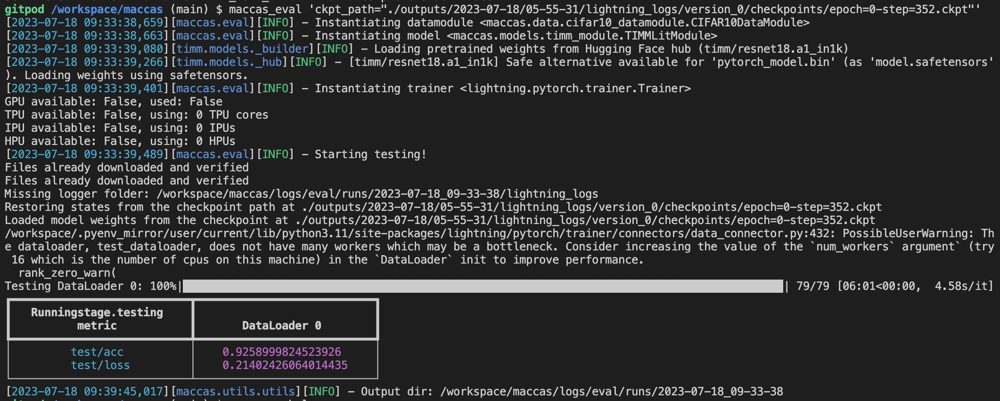

# maccas

How to build package and push to Pypy.

### Development
Install in dev mode
```
pip install -e .
```

## To get help 
Understad different default params
```
maccas_train --help
```
## To run different model
Say, huggingface instead of default from configs.
```maccas_train model=hf```


## Use CIFAR10 dataset and timm pretrained models

Reference repo https://github.com/ashleve/lightning-hydra-template

- Add ```timm==0.9.2``` in requirements.txt
- Add cifa10_datamodule.py in maccas/data folder with class of data module.
- Add cifar10.yaml in configs/data folder to instantiate the data model for training with previous step class references
- Add timm_module.py in maccas/models
- Add timm.yaml to configs folder with previous step references
- Add eval.py to maccas folder similar to train.py
- Add eval.yaml to configs folder ( user must provide checkpoint path )
- Create a ```.dockerignore``` file
- Create a Docker file 


## To train
```maccas_train ```

## To train any image classification model from TIMM
```maccas_train model.net.model_name=resnet50``` OR
```maccas_train model.net.model_name=resnet18``` 

## To get help (veiw defualt params and values)
```maccas_train --help``` or
```maccas_eval --help```

## To load model from checkpoint and run on validation dataset
Change your pathname in below command
```maccas_eval 'ckpt_path="./outputs/2023-07-18/05-55-31/lightning_logs/version_0/checkpoints/epoch=0-step=352.ckpt"'```



## Create a Docker file
```docker build -t pylight .```

docker run -v /outputs:/workspace/outputs pylight


## To run Training
```docker run --rm plight maccas_train```

While running training, to find the volumes...

Get container id

```docker ps```

```docker inspect 90bbb7f7313b```
